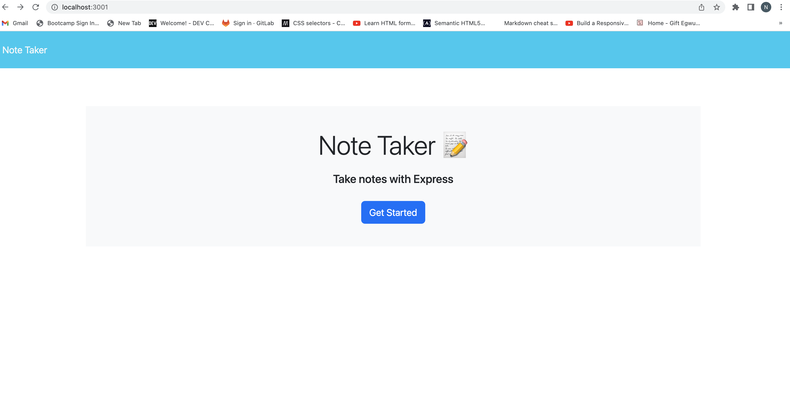

# Nathaniel-Note-Taker
## Description
#
A note taking app that allows the user to write, save, and delete notes. 

## Installation 
#
This app was created using node.js and npm installations such as express. HTML, CSS, and frameworks such as boostrap were used as well. 

## Usage
#
Several files were created using native node.js methods(such as fs) and express in order to create end point routes that connected to the application's front end. 
## Credits
#
Credit goes to UCI for providing front end starter code. 

## License
#
N/A
## Deployment 
#
(https://drive.google.com/file/d/12bUwwzmBUr4qrva99o-GJ15YCBa6s_uZ/view?usp=sharing)

